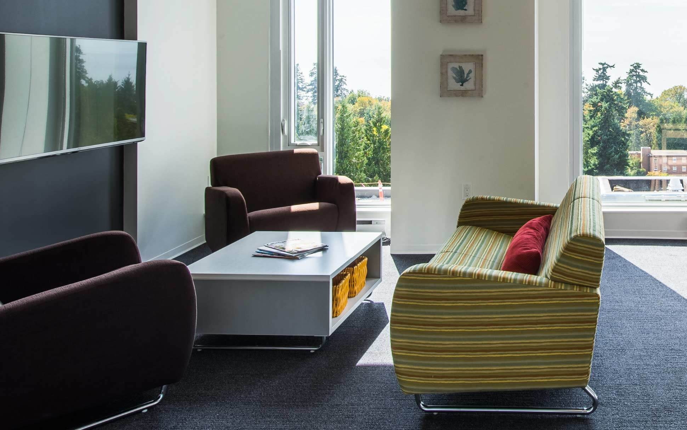

> # The 7th International Symposium on Advanced Control of Industrial Processes (AdCONIP 2022) will be held at The Nest, UBC Vancouver, BC, Canada on August 7-9, 2022

*__Note:__ AdCONIP 2022 will run in a hybrid mode with both face-to-face and online activities.*

  <a class="btn btn-primary btn-lg" href="http://controls.papercept.net/registration/" role="button">Register Now</a>

# Overview
The 7th International Symposium on Advanced Control of Industrial Processes (AdCONIP 2022) will be held at The Nest, UBC Vancouver, BC, Canada on August 7-9, 2022

The International Symposium on Advanced Control of Industrial Processes (AdCONIP) is a triennial international conference. AdCONIP 2022 is the seventh symposium following previous events at Kumamoto (2002), Seoul (2005), Jasper (2008), Hangzhou (2011), Hiroshima (2014), Taipei (2017).

This symposium aims at bringing together researchers and practitioners from academia and industry to discuss the state of the art developments/techniques in advanced control and its applications in industrial processes. The emphasis of this symposium will be on the theory and practice of advanced industrial control methods.

Main topics for the symposium include, but are not limited to, the following:

| Process Control & Automation              | Precision Agriculture                   |
| Adaptive & Learning Systems               | Factory Automation                      |
| Safe Process Operating Systems            | Fault Detection & Diagnosis             |
| Data Mining & Data Analytics              | Intelligent Control                     |
| Signal Processing Robotics & Mechatronics | Data Reconciliation                     |
| Integration of Process Design & Control   | System Behaviours Data-Driven Control   |
| Identification & Estimation               | Control of Cyber-Physical Systems       |
| Computer Integrated Manufacturing         | Control of the Water-Food-Energy Nexus  |
| Health Informatics & Bioinformatics       | Control in Medicine & Health Monitoring |
| Air Pollution Modeling & Control          | Water Conservation & Quality issues     |
| Controller Performance Evaluation         | Process Integration & Optimization      |

---

# Important Dates

Symposium details and dates:



# Conference Location
The conference venue is the AMS Student Nest at the University of British Columbia, Vancouver, BC.

**Address:** 6133 University Blvd, Vancouver, BC V6T 1Z1.

<iframe src="https://www.google.com/maps/embed?pb=!1m18!1m12!1m3!1d2603.5161867574175!2d-123.25221438461551!3d49.26661547983045!2m3!1f0!2f0!3f0!3m2!1i1024!2i768!4f13.1!3m3!1m2!1s0x54867398c216945b%3A0xe9bbdd7328c09b21!2sAMS%20Student%20Nest!5e0!3m2!1sen!2sca!4v1658987232000!5m2!1sen!2sca" width="600" height="450" style="border:0;" allowfullscreen="" loading="lazy" referrerpolicy="no-referrer-when-downgrade"></iframe>

# Registration Fees



# Events
## Conference Banquet

- Date/Time: August 8th 2022 - 6.30PM - 10.00PM
- Location: UBC Sage Restaurant
- See location on [Google Maps](https://www.google.ca/maps/place/Sage/@49.2686377,-123.2576719,19z/data=!4m12!1m6!3m5!1s0x548672b15bef1c83:0x4272b6b37e601a30!2sSage!8m2!3d49.2686687!4d-123.2572729!3m4!1s0x548672b15bef1c83:0x4272b6b37e601a30!8m2!3d49.2686687!4d-123.2572729)

> UBC’s elegant Sage restaurant offers fresh West Coast cuisine alongside impressive ocean views. Sage Restaurant is located west across flagpole plaza from the Chan Centre, inside the Leon and Thea Koerner University Centre.

  

    

      
    

  

  

    

      
    

  
  

# Accomodations

> **The University of British Columbia** is a destination worthy of an overnight stay — or two! Make the most of your campus visit by booking into an affordable and accessible UBC hotel or hostel. Whether you’re looking for cozy-and-practical or roomy-and-luxurious, you’ll find UBC accommodations to suit your style and budget.

For a list of on-campus accomodation options, please visit [https://visit.ubc.ca/eat-drink-and-stay/accommodation/](https://visit.ubc.ca/eat-drink-and-stay/accommodation/)

  

    

      
    

  

  

    

      
    

  
  

# Sponsors



# Contact

Inquiries about the symposium may be addressed to



For more details, see the AdCONIP 2022 [Organizing Committee](./organizers/).
